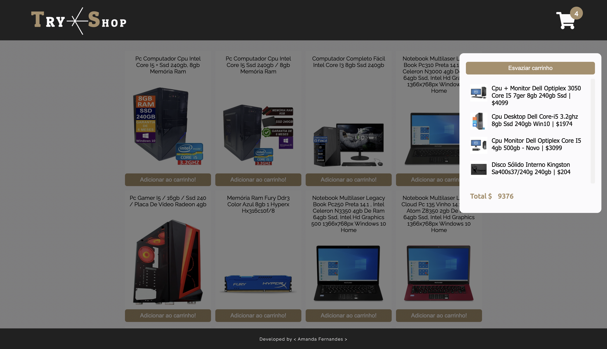

## 📌 Projeto
Projeto _Shopping Cart_ feito durante o Curso de Desenvolvimento Web na Trybe.

#### 👩‍💻 Tecnologias e Ferramentas utilizadas:
- HTML
- CSS
- JavaScript
  - Requisições a API
  - Funções assíncronas

#### 📸 Layout:

