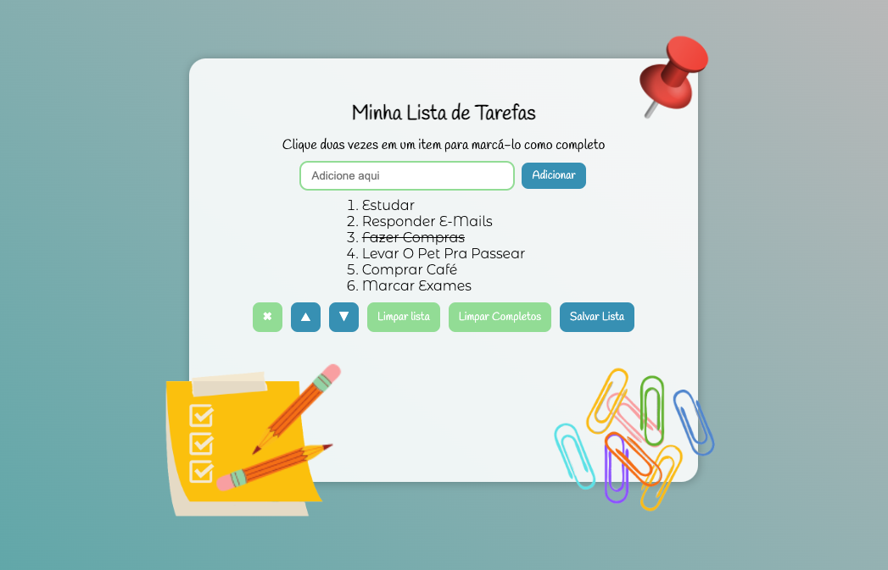

## 📌 Projeto
Aplicativo todolist (lista de tarefas) feito durante o Curso de Desenvolvimento Web na [Trybe](https://www.betrybe.com/).

#### 👩‍💻 Tecnologias e Ferramentas utilizadas:
- HTML
- CSS
- JavaScript

#### 📸 Layout:

