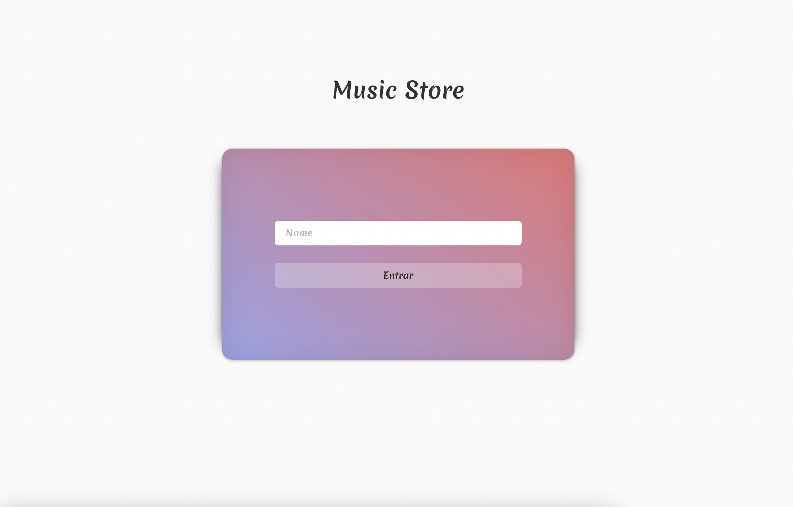
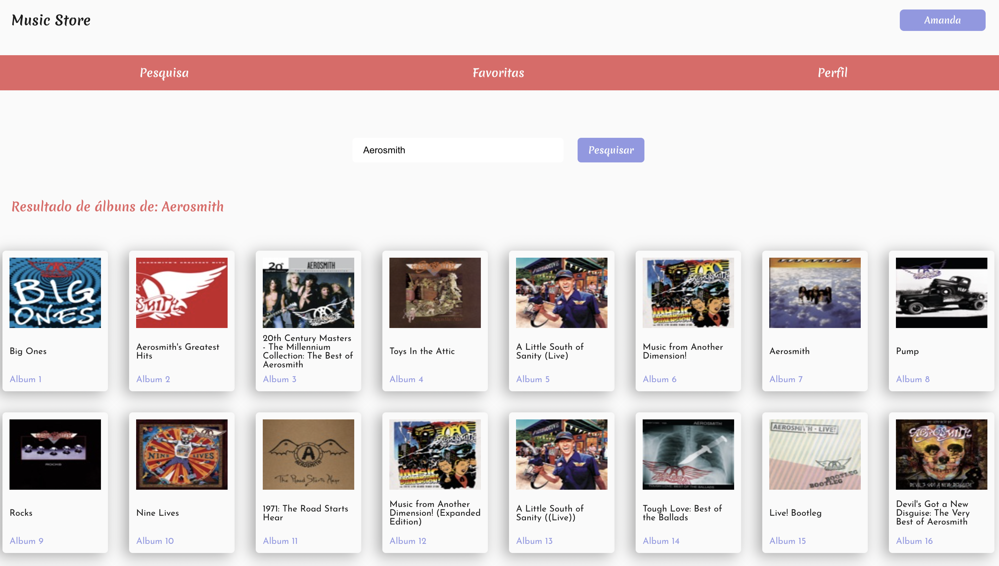
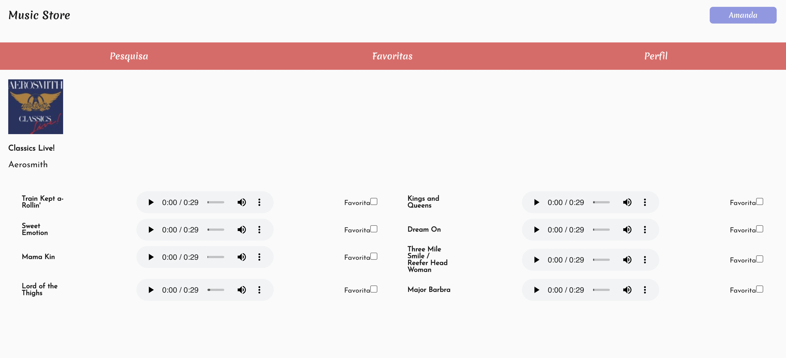

## 📌 Projeto
Projeto _Trybetunes_ feito durante o Curso de Desenvolvimento Web na Trybe.

#### 👩‍💻 Tecnologias e Ferramentas utilizadas:
- HTML
- CSS
- JavaScript
- React JS
  - Ciclo de Vida
  - React Router

#### 📸 Layout:

