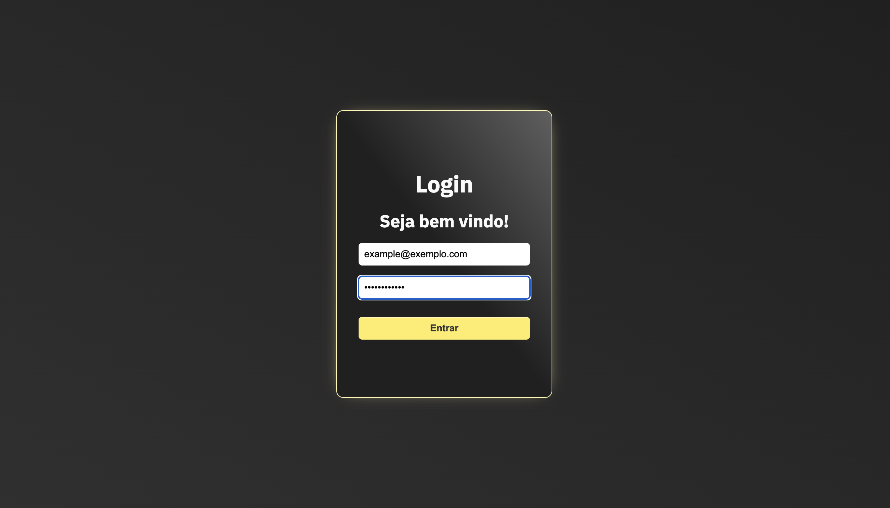
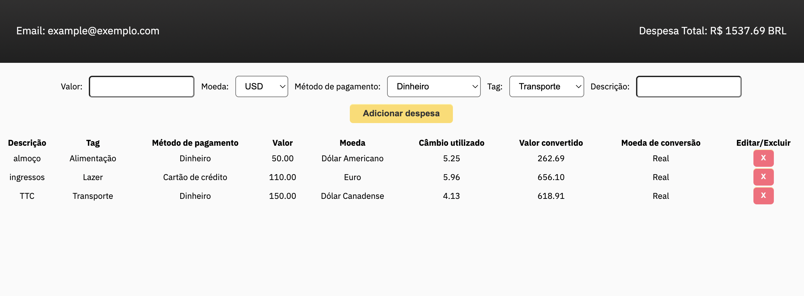

## 📌 Projeto
Projeto _Trybewallet_ feito durante o Curso de Desenvolvimento Web na Trybe.

#### 👩‍💻 Tecnologias e Ferramentas utilizadas:
- HTML
- CSS
- JavaScript
- React
- Redux

#### 📸 Layout:

