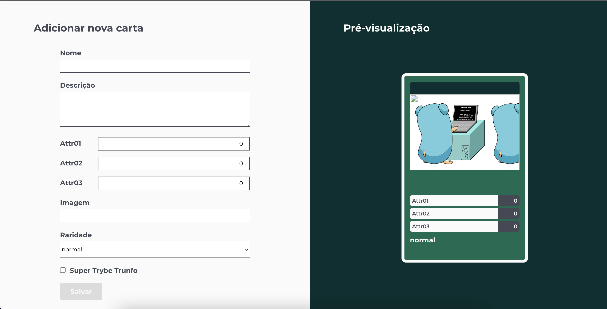
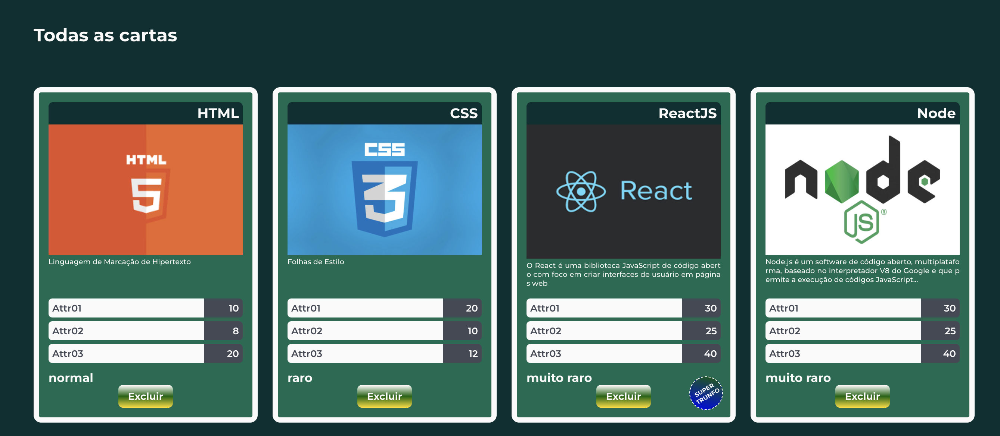

## 📌 Projeto
Projeto _Tryunfo_ feito durante o Curso de Desenvolvimento Web na [Trybe](https://www.betrybe.com/).

#### 👩‍💻 Tecnologias e Ferramentas utilizadas:
- HTML
- CSS
- JavaScript
- React JS

#### 🔗 Link:
[Tryunfo App](https://tryunfo-aferanda.vercel.app/)

#### 📸 Layout:

